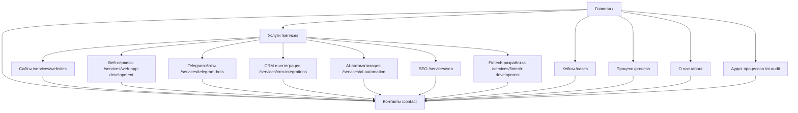
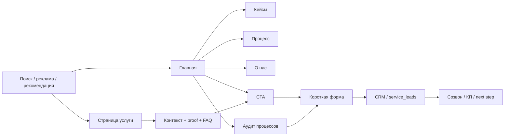

# Исследование по улучшению сайта

## Executive summary

Ветка `new-design` уже собрана на хорошей технической базе: это маркетинговый сайт на Next.js 16.2.4 и React 19.2.4, с root layout на Manrope, динамическими service-routes через `app/services/[service]`, сервисными JSON‑LD/FAQ-блоками и формой лидов, которая уводит данные в Supabase с UTM и `client_id`. То есть фундамент у проекта не «лендинговый», а вполне взрослый: он уже умеет маршрутизировать услуги, собирать лиды и поддерживать отдельные SEO‑метаданные по страницам. fileciteturn8file0L1-L1 fileciteturn11file0L1-L1 fileciteturn29file0L1-L1 fileciteturn30file0L1-L1 fileciteturn21file0L1-L1 fileciteturn33file0L1-L1 fileciteturn37file0L1-L1

Главный разрыв сейчас не в коде и не в визуале, а в рыночном фрейминге. Новая ветка продаёт бренд как AI‑first агентство: home title и H1 начинаются с «ИИ», в хедер вынесен `/ai-audit`, а `services-data` крутится вокруг AI‑агентов, кастомного AI, mobile и CRM. Но в вашем фактическом фокусе первое — сайты, веб‑разработка и автоматизация; AI должен усиливать предложение, а не затмевать его. При этом явно не хватает Telegram‑ботов, SEO и отдельного fintech‑позиционирования. fileciteturn38file0L1-L1 fileciteturn14file0L1-L1 fileciteturn12file0L1-L1

Показательно, что текущий live‑сайт urlSkybricturn19search0 страдает от противоположной проблемы: он слишком широк и выглядит как общая digital‑витрина с веб‑разработкой, SEO, SMM, email, automation, cloud, cybersecurity и IT consulting одновременно. Для premium‑позиционирования новый сайт должен занять середину между этими крайностями: boutique full‑cycle digital partner, который продаёт дорогую реализацию сайтов, веб‑сервисов, Telegram‑ботов, CRM‑связок, SEO и автоматизации, а AI показывает как рабочий слой внутри процесса. citeturn19search0turn19search1 fileciteturn38file0L1-L1 fileciteturn12file0L1-L1

С точки зрения SEO и UX вектор тоже понятен. Официальная поисковая документация рекомендует логичную структуру сайта, описательные URL, уникальные title/description, корректные локализованные версии и structured data, которое описывает видимый контент страницы. На сайтах высокого B2B SaaS / design‑уровня первый экран обычно очень короткий: специализация, proof, понятный CTA; ниже — use cases, services, testimonials, process и финальный conversion block. Именно это и нужно сделать здесь. citeturn0search0turn4search0turn4search4turn10search0turn3search1turn2search1turn8search0turn8search1turn8search2turn8search3turn9search0turn9search1turn9search2

Коротко: правильное решение — не «сделать красивее», а переписать рыночное сообщение. На главной нужно продавать сайты, веб‑сервисы и автоматизацию. В услугах — вывести Telegram‑боты, CRM, SEO и fintech в отдельные коммерческие страницы. В навигации — убрать AI‑audit из одного из четырёх основных пунктов и сделать его secondary path. В доказательствах — вернуть проверяемые факты, если они актуальны: опыт, количество проектов, отрасли, подход, стек, артефакты, а не только общие боли. citeturn19search0turn19search1 fileciteturn38file0L1-L1

## Охват, источники и ограничения

Внешние ориентиры я брал из официальной технической и поисковой документации — urlGoogle Search Centralturn0search2, urlNext.js Metadata APIturn1search0, urlweb.devturn14search0, urlW3C WAIturn15search3, а для интеграционного позиционирования — из официальных материалов urlTelegram Bot APIturn11search0, urlBitrix24 REST APIturn11search1 и urlamoCRM API Referenceturn12search0. Для визуального уровня и service framing дополнительно сравнил официальные сайты urlClayturn8search2, urlRamotionturn8search0, urlAroundaturn8search3, urlInstrumentturn8search1, а также продуктовые ориентиры urlStripeturn9search1, urlVercelturn9search0 и urlLinearturn9search2. citeturn0search2turn1search0turn14search0turn15search3turn11search0turn11search1turn12search0turn8search0turn8search1turn8search2turn8search3turn9search0turn9search1turn9search2

Есть важное ограничение по языкам. У текущего live‑сайта есть RU/EN/UA версии, но в выдаче у украинской версии уже видны потёкшие i18n‑токены вроде `whyUs.title` и `ourServices.title`. Это прямой сигнал: новые языки нельзя выкатывать частично. Поисковая документация рекомендует локализованные версии только как реальные, полноценно поддерживаемые страницы с корректными alternate/hreflang связями. citeturn19search1turn19search2turn10search0turn10search1

Ниже — рабочие допущения для отчёта.

| Допущение | Что это меняет в решении |
|---|---|
| Точные языки сайта не зафиксированы | Рекомендую: RU как primary, EN как secondary, KZ только после полноценной локализации и QA |
| Географическая точка продаж не уточнена | Городские SEO‑лендинги пока не проектирую; сначала — общенациональная структура |
| Нет доступа к Search Console, Ads и Wordstat | Точные объёмы поиска не указываю как подтверждённые; приоритет ставлю по коммерческому intent |
| Бюджет SEO не указан | Ставлю в приоритет money‑pages, schema, cases, technical SEO и service‑clusters |
| По вашему контексту core‑команда компактная, около 5 человек | Позиционирование должно быть boutique / senior‑led, а не «большое агентство обо всём» |

## Аудит текущего репозитория

В просмотренном наборе route‑ и component‑файлов ветка `new-design` выглядит как новый минималистичный marketing‑site с шестью основными направлениями: `/`, `/services`, `/services/[service]`, `/cases`, `/ai-audit` и `/contact`. Домашняя страница уже построена вокруг боли/решения/примеров задач/процесса/формы, а сервисные страницы генерируются централизованно через `serviceList`. Это хорошая база для масштабирования IA без пересборки проекта с нуля. fileciteturn38file0L1-L1 fileciteturn15file0L1-L1 fileciteturn29file0L1-L1 fileciteturn18file0L1-L1 fileciteturn19file0L1-L1 fileciteturn20file0L1-L1

### Что уже получается хорошо

| Что уже есть | Почему это стоит оставить | Источник |
|---|---|---|
| Светлая premium‑палитра, токены цветов и типографики | Это ближе к B2B SaaS / fintech, чем к шумному «крипто‑agency» стилю | `app/globals.css` — fileciteturn27file0L1-L1 |
| Sticky header и lazy‑loading тяжёлого menu overlay | Хорошо для perceived performance и мобильной навигации | `components/site/site-header.tsx` — fileciteturn13file0L1-L1 |
| Page‑level metadata | База для поисковой сегментации уже есть | `app/layout.tsx`, `app/page.tsx`, `app/services/[service]/page.tsx` — fileciteturn11file0L1-L1 fileciteturn38file0L1-L1 fileciteturn29file0L1-L1 |
| Service/FAQ JSON‑LD | Уже есть правильное направление в сторону rich results и явной семантики | `components/services/service-page.tsx`, `app/ai-audit/page.tsx` — fileciteturn30file0L1-L1 fileciteturn19file0L1-L1 |
| Лид‑форма с UTM, honeypot, validation, статусом и записью в Supabase | Это не просто визуальная форма, а реальный lead pipeline | `components/services/service-lead-form.tsx`, `app/api/service-leads/route.ts`, `supabase/sql/service_leads.sql` — fileciteturn21file0L1-L1 fileciteturn33file0L1-L1 fileciteturn37file0L1-L1 |
| Формулировка на cases‑странице «без выдуманных цифр» | Это сильный trust‑marker, его нельзя терять | `app/cases/page.tsx` — fileciteturn18file0L1-L1 |

### Что ослабляет продажу и как это переписать

| Зона | Что сейчас | Почему ослабляет продажу | Рекомендуемая замена | Источник |
|---|---|---|---|---|
| Home metadata и H1 | «Skybric — ИИ, автоматизация и разработка для бизнеса» / «ИИ, автоматизация и разработка под реальные процессы бизнеса» | Вы ставите AI впереди core‑услуги. Для дорогого B2B‑сервиса это снижает читаемость позиционирования и уводит в “ещё одна AI‑студия” | **Title:** «Skybric — премиальная веб‑разработка и автоматизация для бизнеса»  **H1:** «Сайты, веб‑сервисы и автоматизация, которые двигают продажи и операционку»  **Subtitle:** «Проектируем цифровые системы для B2B и fintech: от продающих сайтов и кабинетов до Telegram‑ботов, CRM‑интеграций и SEO‑роста. AI подключаем там, где он реально сокращает ручную работу.» | `app/page.tsx` — fileciteturn38file0L1-L1 |
| Сетка услуг | В репозитории фокус на `ai-agents`, `custom-ai-development`, `web-development`, `mobile-app-development`, `ai-crm-integrations` | Нет Telegram‑ботов, SEO и fintech как явных money‑pages; mobile перегружает фокус, если это не core revenue | Заменить primary taxonomy на: `websites`, `web-app-development`, `telegram-bots`, `crm-integrations`, `ai-automation`, `seo`, `fintech-development`. Mobile оставить как nested capability, а не как один из первых семи продающих слотов | `lib/services/services-data.ts` — fileciteturn12file0L1-L1 |
| Навигация | `Услуги / Кейсы / ИИ-аудит / Контакты` | Один из четырёх основных пунктов уходит в lead magnet, а не в core‑бренд: нет `Процесс`, `О нас`, явного trust path | Сделать nav: `Услуги / Кейсы / Процесс / О нас / Контакты`. `Аудит процессов` оставить как secondary CTA в hero, footer и service pages | `components/site/site-header-nav-data.ts` — fileciteturn14file0L1-L1 |
| Hero aside | «Что обычно закрываем в первом проекте» с тремя общими пунктами и CTA на `/ai-audit` | Блок полезный, но он не создаёт эффекта premium‑доказательства | Заменить на блок **«Почему с нами идут в дорогую разработку»**: подтверждённые годы опыта, количество проектов, отрасли, типы решений, direct senior involvement. Если текущие факты live‑сайта актуальны, можно вернуть 6+ лет и 40+ проектов, но только после внутренней проверки | `app/page.tsx` — fileciteturn38file0L1-L1; live site — citeturn19search0turn19search1 |
| Cases | «Примеры задач вместо выдуманных кейсов» и типовые сценарии | Это честно, но пока слишком абстрактно и слабо продаёт дорогую реализацию | Заменить framing на **«Разборы задач: где ломался процесс, что мы собрали, какие системы связали»**. Структура кейса: задача, ограничения, архитектура, стек, интеграции, артефакты, что стало проще | `app/page.tsx`, `app/cases/page.tsx` — fileciteturn38file0L1-L1 fileciteturn18file0L1-L1 |
| AI audit | Полноценная отдельная продажная страница, плюс `areaServed: "RU"` и `priceCurrency: "RUB"` | Для сайта с фокусом на entity["country","Казахстан","Central Asia"] это создаёт географический и валютный конфликт; к тому же AI‑audit слишком доминирует в первом слое позиционирования | Оставить страницу, но переименовать в **«Аудит процессов и автоматизации»**, убрать из primary nav, а в schema сменить географию на KZ/global или убрать цену/валюту вовсе, поскольку аудит бесплатный | `app/ai-audit/page.tsx`, `components/services/service-page.tsx` — fileciteturn19file0L1-L1 fileciteturn30file0L1-L1 |
| Contact и lead form | Форма собирает имя/телефон/telegram/email/company/message, валидирует контакт и длину сообщения | Для B2B‑квалификации не хватает service intent и стадии проекта; для premium продажи нужна чуть более точная маршрутизация лида | Оставить short form, но добавить: `интересует услуга`, `стадия проекта`, `опционально бюджетный диапазон`. Под формой — обещание уровня ответа, а не общее «свяжемся» | `components/services/service-lead-form.tsx`, `lib/leads/validate-service-lead.ts`, `supabase/sql/service_leads.sql` — fileciteturn21file0L1-L1 fileciteturn35file0L1-L1 fileciteturn37file0L1-L1 |
| Root SEO‑infra | В просмотренных root/page‑файлах есть title/description/canonical, но нет `metadataBase`, Open Graph/Twitter cards и `WebSite` site‑name markup | Это ограничивает social preview, canonical hygiene и управляемость site name | Добавить в root layout: `metadataBase`, `title.template`, Open Graph, Twitter, icon/manifest, `WebSite` + `Organization` JSON‑LD на home | `app/layout.tsx`, `app/page.tsx` — fileciteturn11file0L1-L1 fileciteturn38file0L1-L1 |
| Контентная документация | `README.md` остаётся почти стандартным create‑next‑app шаблоном | Для команды это означает отсутствие content inventory, claims registry и правил по SEO/meta/schema | Добавить внутренний `CONTENT_GUIDE.md`: карта страниц, утверждённые claim‑блоки, правила tone of voice, schema matrix и redirect plan | `README.md` — fileciteturn25file0L1-L1 |

## Новая архитектура сайта

Поисковая документация советует делать сайт логично организованным, использовать описательные URL, а titles и snippets — уникальными и соответствующими содержанию. Для service‑business это особенно важно: органика часто входит не через главную, а сразу в money‑page. Именно поэтому архитектура ниже построена не от “красивой витрины”, а от входа пользователя в конкретную услугу. citeturn0search0turn4search0turn4search4

### Таблица страниц, URL и мета‑пакета

| Страница | URL | Роль страницы | Meta title | Meta description |
|---|---|---|---|---|
| Главная | `/` | Бренд и маршрутизация в услуги | Skybric — премиальная веб‑разработка и автоматизация для бизнеса | Разрабатываем сайты, веб‑сервисы, Telegram‑ботов, CRM‑интеграции и SEO‑системы для B2B и fintech. От стратегии и дизайна до кода и запуска. |
| Услуги | `/services` | Хаб всех коммерческих направлений | Услуги Skybric — сайты, Telegram‑боты, CRM, SEO и fintech | Технологические услуги полного цикла: сайты, кабинеты, Telegram‑боты, CRM‑интеграции, AI‑автоматизация, SEO и fintech‑разработка. |
| Сайты | `/services/websites` | Commercial intent: корпоративные сайты и посадочные страницы | Разработка сайтов для B2B и fintech | Проектируем корпоративные сайты и посадочные страницы, которые быстро объясняют продукт, снимают возражения и создают управляемый поток заявок. |
| Веб‑сервисы | `/services/web-app-development` | Кабинеты, порталы, внутренние системы | Веб‑сервисы и личные кабинеты для бизнеса | Создаём веб‑приложения, кабинеты и внутренние сервисы с продуманной архитектурой, ролями, интеграциями и безопасным ростом. |
| Telegram‑боты | `/services/telegram-bots` | Коммерческий вход по Telegram‑сценариям | Telegram‑боты для продаж, сервиса и автоматизации | Разрабатываем Telegram‑ботов для заявок, клиентского сервиса, уведомлений, квалификации лидов и внутренних процессов. |
| CRM и интеграции | `/services/crm-integrations` | Воронка, синхронизация, автоматизация | CRM‑интеграции и автоматизация процессов | Связываем сайт, Telegram, формы, документы и командные процессы с CRM, чтобы меньше терять лиды и ручное время. |
| AI‑автоматизация | `/services/ai-automation` | AI как слой внутри workflow | AI‑автоматизация для бизнеса | Подключаем AI там, где он реально сокращает рутину: ответы, классификация заявок, черновики документов, поиск знаний и follow‑up. |
| SEO | `/services/seo` | Органический рост и technical SEO | SEO для B2B, SaaS и корпоративных сайтов | Строим SEO как систему продаж: от архитектуры и семантики до контента, technical SEO, внутренних связей и роста коммерческих страниц. |
| Fintech | `/services/fintech-development` | Узкий вертикальный trust‑page | Fintech‑разработка и платежные сценарии | Разрабатываем интерфейсы и сервисы для fintech‑продуктов: onboarding, billing, кабинеты, платёжные сценарии и сложные B2B‑процессы. |
| Кейсы | `/cases` | Доказательство подхода | Кейсы и разборы задач | Показываем не “магические проценты”, а реальную структуру задач: контекст, ограничения, архитектуру решения, стек и интеграции. |
| Процесс | `/process` | Снятие риска перед продажей | Как мы ведём проект: от аудита до запуска | Объясняем, как проходит discovery, проектирование, реализация, интеграции, тестирование и запуск без потери управляемости. |
| О нас | `/about` | Boutique‑credibility и trust | О Skybric — compact senior team полного цикла | Показываем, кто ведёт проекты, как устроена работа с заказчиком и почему маленькая senior‑команда может быть сильнее громоздкого агентства. |
| Контакты | `/contact` | Конверсия и квалификация | Обсудить проект | Короткая форма для B2B‑проекта: расскажите задачу, и мы предложим подходящий формат решения, а не общий разговор “обо всём”. |
| Аудит процессов | `/ai-audit` | Secondary lead magnet | Аудит процессов и автоматизации | Разберём, где теряются лиды, время и управляемость, и покажем, какой участок автоматизировать первым. |

### Предлагаемый пользовательский путь

## Финальные тексты для hero, service blocks и microcopy

### Hero block

**H1**  
Сайты, веб‑сервисы и автоматизация, которые двигают продажи и операционку

**Subtitle**  
Skybric проектирует цифровые системы для B2B и fintech: от продающих сайтов и личных кабинетов до Telegram‑ботов, CRM‑интеграций и SEO‑роста. AI подключаем там, где он реально сокращает ручную работу, ускоряет команду и даёт больше контроля.

**Proof line**  
Веб‑разработка • Telegram • CRM • SEO • AI‑automation • B2B / fintech

**Primary CTA**  
Обсудить архитектуру проекта

**Secondary CTA**  
Посмотреть разборы задач

**Hero side card title**  
Что получает бизнес на выходе

**Hero side card points**  
Понятную структуру решения  
Маршрут заявки без ручных провалов  
Интеграции с CRM и внутренними системами  
Сайт или сервис, который можно масштабировать

### Тексты для блока услуг

| Услуга | Финальный текст карточки | CTA |
|---|---|---|
| Сайты для бизнеса | Разрабатываем корпоративные сайты и посадочные страницы, которые быстро объясняют продукт, снимают лишние вопросы и доводят пользователя до следующего шага без визуального шума и путаницы. | Нужен сайт, который продаёт |
| Веб‑сервисы и кабинеты | Собираем личные кабинеты, внутренние порталы и сервисы, где важны роли, статусы, документы, история действий и безопасная логика роста. | Обсудить веб‑сервис |
| Telegram‑боты | Делаем Telegram‑ботов для лидогенерации, клиентского сервиса, уведомлений, оплаты, онбординга и внутренних сценариев команды. Не как игрушку, а как рабочую точку процесса. | Запустить Telegram‑сценарий |
| CRM и интеграции | Связываем сайт, Telegram, формы, заявки, документы и менеджеров с CRM так, чтобы меньше терять лиды, ручных действий и контекста по клиенту. | Собрать контур интеграций |
| AI‑автоматизация | Подключаем AI туда, где он экономит время: черновики ответов, квалификация заявки, поиск знаний, первичная обработка документов и follow‑up. | Найти первую AI‑задачу |
| SEO | Строим SEO не как набор статей “для трафика”, а как систему спроса на money‑pages: архитектура, семантика, контент, внутренняя связность и technical SEO. | Построить SEO‑систему |
| Fintech‑разработка | Проектируем и реализуем fintech‑интерфейсы и сервисы, где важны доверие, логика платежей, понятный onboarding, строгая структура данных и высокий уровень аккуратности. | Обсудить fintech‑контур |

### Microcopy для CTA, карточек, team и process

| Компонент | Финальный текст |
|---|---|
| Header CTA | Обсудить проект |
| Hero secondary CTA | Посмотреть разборы задач |
| Cases CTA | Разобрать похожую задачу |
| Contact block title | Опишите задачу в одном сообщении |
| Contact helper text | Мы вернёмся с вариантом решения, а не с общим “давайте созвонимся”. |
| Submit button | Отправить задачу |
| Success message | Задачу получили. Разберём контекст и вернёмся с понятным следующим шагом. |
| Team section heading | Компактная senior‑команда, которая ведёт проект руками |
| Team section text | Без длинной передачи задач между отделами. Тот, кто проектирует архитектуру, остаётся в проекте до запуска и доработок. |
| Process heading | Как мы переводим задачу в рабочую систему |
| Process step 1 | Разбираем процесс и ограничения |
| Process step 2 | Проектируем архитектуру и контент |
| Process step 3 | Реализуем, интегрируем и тестируем |
| Process step 4 | Запускаем, измеряем и улучшаем |
| FAQ intro | Отвечаем коротко и по делу — без формулировок “всё зависит”. |

## SEO‑стратегия для Казахстана и international

Для entity["country","Казахстан","Central Asia"] я бы делал RU‑first архитектуру сайта и только затем полноценную EN‑версию. KZ‑версию имеет смысл добавлять не как перевод меню и футера, а как настоящую локализацию. Поисковая документация рекомендует логичную структуру, понятные URL, качественные title links и snippets, а локализованные версии — только как реальные варианты страниц с корректным `hreflang`. Structured data должно описывать видимый контент, а не жить отдельно от страницы. citeturn0search0turn4search0turn4search4turn10search0turn10search1turn2search1

В этой версии отчёта я **не указываю подтверждённые поисковые объёмы**: без доступа к Search Console / Ads / Wordstat такие числа будут выглядеть точными, но не будут верифицированы. Поэтому в таблице ниже — приоритет по коммерческому intent.

| Рынок | Кластер запроса | Intent | Приоритет | Публичный volume | Рекомендуемая страница |
|---|---|---|---|---|---|
| KZ / RU | разработка сайтов для бизнеса | Commercial | Высокий | н/д | `/services/websites` |
| KZ / RU | разработка корпоративного сайта | Commercial | Высокий | н/д | `/services/websites` |
| KZ / RU | разработка веб‑приложений | Commercial | Высокий | н/д | `/services/web-app-development` |
| KZ / RU | разработка телеграм‑ботов | Commercial | Высокий | н/д | `/services/telegram-bots` |
| KZ / RU | CRM интеграция / автоматизация CRM | Commercial | Высокий | н/д | `/services/crm-integrations` |
| KZ / RU | автоматизация бизнеса с AI | Commercial | Средне‑высокий | н/д | `/services/ai-automation` |
| KZ / RU | SEO для корпоративного сайта | Commercial | Высокий | н/д | `/services/seo` |
| KZ / RU | fintech разработка | Commercial | Средне‑высокий | н/д | `/services/fintech-development` |
| International / EN | custom web development agency | Commercial | Высокий | н/д | EN‑версия `/services/websites` |
| International / EN | web application development company | Commercial | Высокий | н/д | EN‑версия `/services/web-app-development` |
| International / EN | telegram bot development company | Commercial | Высокий | н/д | EN‑версия `/services/telegram-bots` |
| International / EN | CRM integration agency | Commercial | Высокий | н/д | EN‑версия `/services/crm-integrations` |
| International / EN | AI automation agency | Commercial | Средне‑высокий | н/д | EN‑версия `/services/ai-automation` |
| International / EN | fintech software development company | Commercial | Средне‑высокий | н/д | EN‑версия `/services/fintech-development` |
| International / EN | B2B SEO agency | Commercial | Высокий | н/д | EN‑версия `/services/seo` |

После запуска базовых service‑pages я бы отдельно подкластерил интеграционные FAQ и use cases под системы с открытой официальной документацией — например, под urlBitrix24turn11search1, urlamoCRMturn12search0 и сценарии на базе urlTelegram Bot APIturn11search0. Это даст и SEO‑хвост, и более убедимый коммерческий сигнал. citeturn11search0turn11search1turn12search0

Отдельно важен технический SEO‑момент: в текущем коде на service‑pages уже есть metadata и Service/FAQ JSON‑LD, но `areaServed: "RU"` и `RUB` на audit‑странице конфликтуют с казахстанским фокусом. Это нужно поправить до релиза. fileciteturn30file0L1-L1 fileciteturn19file0L1-L1

## Визуальное направление и frontend‑реализация

По визуалу вектор уже выбран правильно: светлая база, крупная типографика, тёмные CTA и один технологичный акцентный цвет. Для premium B2B SaaS / fintech это сильнее, чем модный “dark agency” с переизбытком графики. По WCAG минимум для обычного текста — 4.5:1, для UI/non‑text — 3:1. Если считать по формуле `contrast = (L1 + 0.05) / (L2 + 0.05)`, то текущие токены дают хорошие результаты: `#121212` на `#F6F3EE` ≈ **16.9:1**, `#6B6B6B` на `#F6F3EE` ≈ **4.81:1**, `#6D4AFF` на `#F6F3EE` ≈ **4.66:1**. Но `#6D4AFF` на тёмном фоне `#18181B` ≈ **3.44:1** — этого достаточно для некоторых UI‑состояний, но не для мелкого body‑текста. fileciteturn27file0L1-L1 citeturn15search3turn15search2turn14search1

Если брать визуальные референсы уровня продукта и дорогого digital, ориентир я бы держал не на “агентский шум”, а на спокойное сочетание product clarity + proof + modular UI, как это делают urlClayturn8search2, urlRamotionturn8search0, urlAroundaturn8search3, а по чистоте первого экрана и логике модулей — urlStripeturn9search1, urlVercelturn9search0 и urlLinearturn9search2. Во всех этих примерах первый экран короткий, ниже быстро появляется proof, сервисная структура и интерфейсные фрагменты. citeturn8search0turn8search2turn8search3turn9search0turn9search1turn9search2

Исследования usability также поддерживают вашу текущую светлую и структурную логику: пользователи сканируют страницы, а не читают их подряд, и декоративные изображения, особенно на мобильных, должны использоваться только когда они реально добавляют смысл. Поэтому вместо крупных абстрактных баннеров лучше использовать: UI‑мокапы кабинета, диаграммы маршрута заявки, CRM‑карточки, schema‑подобные “data cards”, фрагменты интеграционных потоков и анонимизированные before/after screen patterns. citeturn7search0turn7search4

### Спецификация визуальной системы для дизайнера

| Элемент | Рекомендация |
|---|---|
| Фон | Оставить тёплый ivory `#F6F3EE` как primary background |
| Surface | Белый `#FFFFFF` для карточек и form‑блоков |
| Основной текст | `#121212` |
| Вторичный текст | `#4B4B4B` для body, `#6B6B6B` для labels/meta |
| Accent | `#6D4AFF` — только для выделения действия, статуса, ссылок и акцентных меток |
| Signal color | `#B8FF5C` — очень дозированно: badges, availability, quick highlights |
| Радиусы | 24–32 px для major cards, full radius для CTA |
| Типографика | Оставить Manrope; дополнительно можно ввести моноширинный акцентный стиль только для technical labels / stack / metrics |
| Сетка | 12‑column desktop, 8‑column tablet, 4‑column mobile |
| Ширина текста | Основной body не шире 68–72ch |
| Вертикальный ритм | 96 px между крупными секциями на desktop, 72 px на tablet, 48 px на mobile |
| Изображения | Только информативные: UI, dashboards, schema‑flows, интеграционные маршруты, анонимизированные артефакты |

### Компоненты, которые должны появиться на сайте

| Компонент | Зачем он нужен |
|---|---|
| Hero с proof‑rail | Быстро фиксирует специализацию и уровень |
| Service grid с жёсткой типизацией | Позволяет войти в конкретную money‑page |
| Trust strip | Годы опыта, проекты, отрасли, workflow‑stack — только если факты подтверждены |
| Cases preview | Доказательство инженерного и процессного мышления |
| Process band | Снимает риск “они просто красиво нарисуют” |
| Industries / fit block | Помогает B2B посетителю быстро узнать себя |
| Architecture visual | Показывает технологичность без перегруза текстом |
| FAQ | Закрывает возражения рядом с CTA |
| Final CTA + short form | Основная конверсионная зона |
| Founder / team note | Для boutique‑модели это критично для доверия |

### Frontend‑реализация и technical notes

Официальная документация Next.js рекомендует использовать `metadataBase` для относительных URL в metadata, а поисковая документация — корректную site‑name разметку, видимое и валидное structured data, качественные titles/snippets и локализованные alternate‑версии только для полноценно поддерживаемых страниц. web.dev подчёркивает важность LCP, CLS и INP, а W3C — видимого focus state и контрастности. В просмотренных root/page‑файлах у вас уже есть page metadata, dynamic service metadata, FAQ/Service JSON‑LD, `aria-live` в форме и focus‑styles, но я не увидел в reviewed root/page files `metadataBase`, Open Graph / Twitter cards и home‑уровневого `WebSite` / `Organization` markup. fileciteturn11file0L1-L1 fileciteturn29file0L1-L1 fileciteturn30file0L1-L1 fileciteturn21file0L1-L1 citeturn1search0turn3search1turn2search1turn4search0turn4search4turn10search0turn1search3turn1search4turn14search0turn15search3turn15search2turn14search1

| Направление | Что добавить / изменить |
|---|---|
| Metadata | `metadataBase`, `title.template`, Open Graph, Twitter cards, favicon/manifest |
| Site name | `WebSite` JSON‑LD на home с `name`, `alternateName`, `url` |
| Organization | `Organization` JSON‑LD на home; если есть публичный офис и контактные данные — можно дополнить, но только правдой |
| Breadcrumbs | На service‑pages вывести хлебные крошки и `BreadcrumbList` |
| Service schema | Оставить `Service` только там, где содержание страницы реально описывает услугу; поправить `areaServed` |
| FAQ schema | Оставлять только на страницах, где FAQ видим пользователю |
| Hreflang | Подключать только когда RU/EN/KZ страницы реально готовы и взаимно связаны |
| Forms | Добавить явный label/description для ошибок, privacy‑строку и service intent |
| Analytics | Подключить Search Console и event taxonomy: `cta_click`, `form_start`, `form_submit`, `case_view`, `service_page_view` |
| Lead DB | Добавить поля `service_interest`, `project_stage`, `budget_band`, `lead_score`, `meeting_booked` |
| Performance | Любой крупный visual above‑the‑fold делать без layout shift; изображения — с заданными размерами; анимации — дозированно и с проверкой INP |
| Accessibility | Сохранить focus ring, не уводить мелкий текст в violet на dark, использовать disclosure/breadcrumb patterns корректно |

## Приоритетный roadmap и A/B‑тесты

### Дорожная карта изменений

| Этап | Что делаем | Эффект |
|---|---|---|
| Первый спринт | Переписываем home H1/subtitle/meta, меняем taxonomy услуг, переделываем header nav, убираем AI‑audit из primary nav | Сразу повышает читаемость позиционирования и CTR в первый экран |
| Второй спринт | Собираем новые service‑pages: websites, web‑apps, telegram‑bots, crm, ai‑automation, seo, fintech | Создаёт полноценный SEO и sales backbone |
| Третий спринт | Переписываем cases как “разборы задач”, добавляем proof‑rail, process, about | Повышает доверие и уменьшает риск восприятия “маленькая студия без глубины” |
| Четвёртый спринт | Дорабатываем metadataBase, OG/Twitter, WebSite/Organization, BreadcrumbList, analytics events | Закрывает technical SEO и social preview |
| Пятый спринт | Запускаем EN‑версию только на готовых коммерческих страницах; KZ — после контентного QA | Даёт controlled international scale без поломки локализации |
| Шестой спринт | Начинаем semantic expansion: integrations FAQ, founder notes, industry cases, SEO content around service intent | Расширяет long‑tail и усиливает коммерческую глубину |

### A/B‑тесты, которые стоит запускать первыми

| Гипотеза | Вариант A | Вариант B | Основная метрика |
|---|---|---|---|
| Hero framing | «Сайты, веб‑сервисы и автоматизация…» | «Цифровые системы для продаж и операционки…» | CTA CTR, scroll depth |
| Главный CTA | `Обсудить архитектуру проекта` | `Разобрать задачу за 30 минут` | Form start rate |
| Позиция lead magnet | `Аудит процессов` только в hero / footer | Отдельный CTA на service pages | Qualified lead rate |
| Тип cases preview | Текстовый сценарий | Сценарий + архитектурный visual | Click‑through to `/cases` |
| Форма | Только message + contact | Message + service interest + project stage | Submit rate / lead quality |
| Proof block | Сразу под hero | После services | Engagement и conversion to contact |

Если бы нужно было выбрать **только один спринт**, я бы начал не с дизайна и не с логотипа, а с трёх шагов: **переписать home framing, перестроить taxonomy услуг и передвинуть AI‑audit во вторичный путь**. Это даст самый быстрый эффект на восприятие бренда и качество входящих лидов без тяжёлой технической переделки.